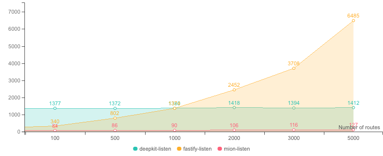

# Cold Starts

Cold start times are measure using the http server but are also indicative of how the [serverless version](https://github.com/MionKit/mion/tree/master/packages/serverless) could perform in this regard, as both `@MionKit/http` an `@MionKit/serverless` are just a wrapper around `@MionKit/router` which contains all the logic.

- These metrics show the start time when loading 1 route and then increasing the number or routes loaded until 5,000 routes.
- The `startup time` is the time it takes to load the @MionKit/http library itself + create the routes object in memory.
- The `listen time` is the time it takes to parse and generate a flat router so there is no need to process the url when a request come in.

## Benchmark Results
* __Machine:__ darwin x64 | 8 vCPUs | 16.0GB Mem
* __Node:__ `v16.18.0`
* __Run:__ Tue Jul 25 2023 23:22:50 GMT+0100 (Irish Standard Time)
* __Method:__ `npm run metrics` (samples: 5)
* __startup:__ time elapsed to setup the application
* __listen:__ time elapsed until the http server is ready to accept requests (cold start)

### Cold starts:  listen time (ms) lower is better 

  | | startup(ms) | listen(ms) |
  |-| -           | -          |
| 10-startup-deepkit-routes.js | 1371 | 1373 |
| 10-startup-fastify-routes.js | 154 | 227 |
| 10-startup-mion-routes.js | 75 | 84 |
| 100-startup-deepkit-routes.js | 1372 | 1374 |
| 100-startup-fastify-routes.js | 169 | 339 |
| 100-startup-mion-routes.js | 74 | 84 |
| 500-startup-deepkit-routes.js | 1370 | 1372 |
| 500-startup-fastify-routes.js | 257 | 799 |
| 500-startup-mion-routes.js | 74 | 87 |
| 1000-startup-deepkit-routes.js | 1378 | 1379 |
| 1000-startup-fastify-routes.js | 355 | 1365 |
| 1000-startup-mion-routes.js | 75 | 91 |
| 2000-startup-deepkit-routes.js | 1409 | 1410 |
| 2000-startup-fastify-routes.js | 567 | 2443 |
| 2000-startup-mion-routes.js | 75 | 106 |
| 3000-startup-deepkit-routes.js | 1391 | 1393 |
| 3000-startup-fastify-routes.js | 838 | 3694 |
| 3000-startup-mion-routes.js | 77 | 116 |
| 5000-startup-deepkit-routes.js | 1407 | 1409 |
| 5000-startup-fastify-routes.js | 1824 | 6460 |
| 5000-startup-mion-routes.js | 78 | 127 |
| startup-listen.js | 79 | 83 |
