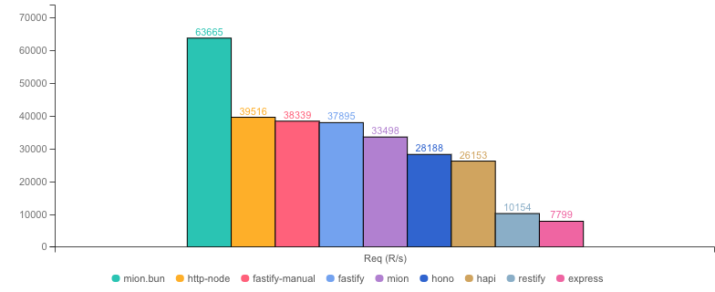
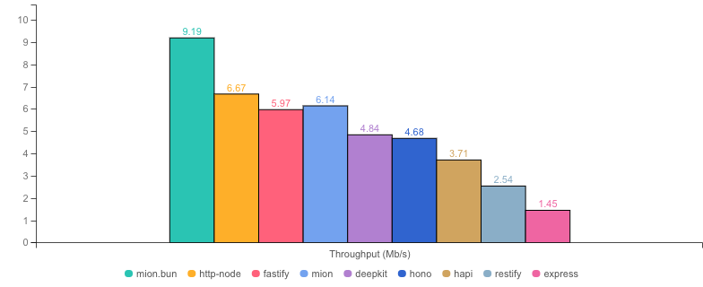
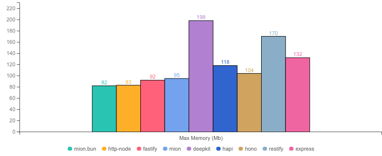
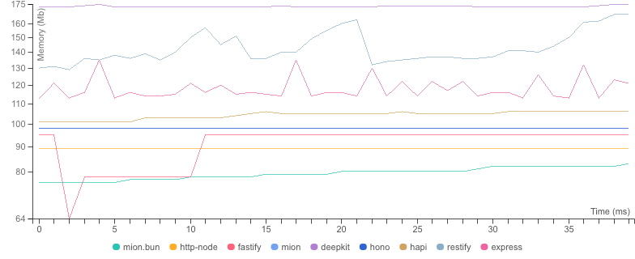

<p align="center">
  <picture>
    <source media="(prefers-color-scheme: dark)" srcset="./assets/public/logo-dark.svg?raw=true">
    <source media="(prefers-color-scheme: light)" srcset="./assets/public/logo.svg?raw=true">
    
  </picture>
</p>

<p align="center">
  <strong>Benchmarks for  @mionkit/http 🚀</strong><br/>
</p>

<p align=center>
  
  
</p>

# mion Http Benchmarks (hello world)

## What's tested

These benchmarks test the typical hello world response, not very useful, but shows the theoretical upper limit of each framework.

> The hello world benchmark is related to the router's performance as parameters validation is not involved.

```ts
// ### mion ###
export const routes = {
  hello: (): { hello: string } => ({ hello: "world" }),
} satisfies Routes;

// ### Express ###
app.get("/hello", function (req, res) {
  res.json({ hello: "world" });
});
```

## Benchmark Results

* __Machine:__ darwin x64 | 8 vCPUs | 16.0GB Mem
* __Node:__ `v20.11.0`
* __Run:__ Sun Jan 28 2024 22:01:54 GMT+0000 (Greenwich Mean Time)
* __Method:__ `autocannon -c 100 -d 40.21 -p 10 localhost:3000` (two rounds; one to warm-up, one to measure)

#### Req (R/s) 




#### Throughput (Mb/s) 




#### Latency (ms) 


#### Max Memory (Mb) 




#### Memory Series (MB) 




|                | Version   | Router | Req (R/s)   | Latency (ms) | Output (Mb/s) | Max Memory (Mb) | Max Cpu (%) | Validation | Description                                                                         |
| :--            | --:       | --:    | :-:         | --:          | --:           | --:             | --:         | :-:        | :--                                                                                 |
| mion.bun       | 0.6.2     | ✓      | 63665.6     | 15.29        | 9.90          | 98              | 106         | ✓          | mion using bun, automatic validation and serialization                              |
| http-node      | 16.18.0   | ✗      | 39516.0     | 24.81        | 7.05          | 80              | 126         | ✗          | bare node http server, should be the theoretical upper limit in node.js performance |
| fastify-manual | 3.12.6    | ✓      | 38339.2     | 25.58        | 6.87          | 89              | 121         | -          | manually validated parameters                                                       |
| fastify        | 4.10.2    | ✓      | 37895.2     | 25.89        | 6.79          | 87              | 122         | -          | Validation using schemas and ajv. schemas are generated manually                    |
| **mion**       | **0.6.2** | **✓**  | **33498.2** | **29.35**    | **6.71**      | **90**          | **127**     | **✓**      | **Automatic validation and serialization out of the box**                           |
| hono           | 3.12.6    | ✓      | 28188.0     | 34.97        | 5.03          | 88              | 122         | ✗          | hono node server, manual validation or third party tools                            |
| hapi           | 21.3.2    | ✓      | 26153.2     | 37.73        | 4.66          | 114             | 129         | ✗          | validation using joi or third party tools                                           |
| restify        | 11.1.0    | ✓      | 10154.8     | 97.95        | 2.51          | 162             | 139         | ✗          | manual validation or third party tools                                              |
| express        | 4.18.2    | ✓      | 7799.7      | 127.53       | 1.39          | 119             | 124         | ✗          | manual validation or third party tools                                              |
