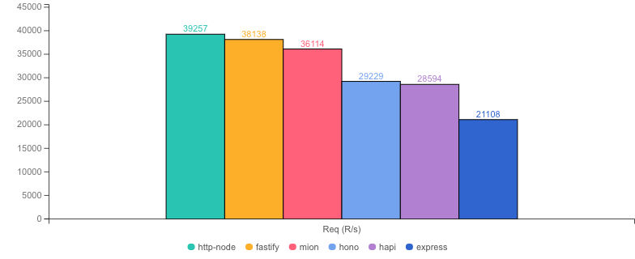
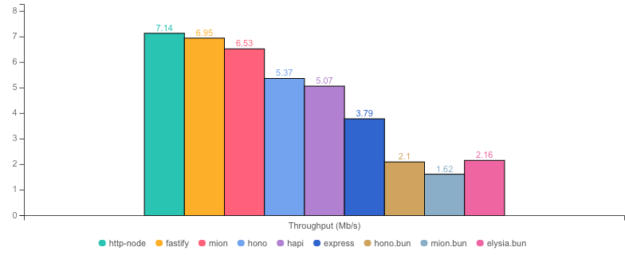
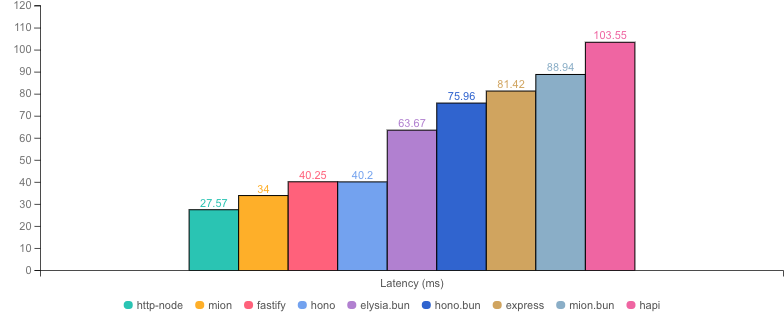
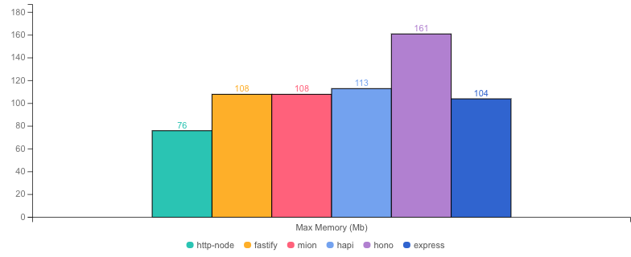
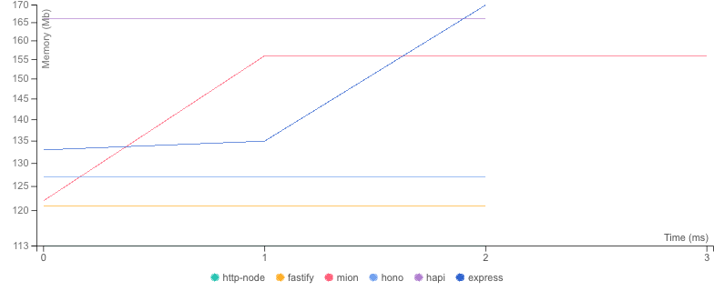

<p align="center">
  <picture>
    <source media="(prefers-color-scheme: dark)" srcset="./assets/public/logo-dark.svg?raw=true">
    <source media="(prefers-color-scheme: light)" srcset="./assets/public/logo.svg?raw=true">
    
  </picture>
</p>

<p align="center">
  <strong>Benchmarks for  @mionkit/http 🚀</strong><br/>
</p>

<p align=center>
  
  
</p>

# mion Http Benchmarks (hello world)

## What's tested

These benchmarks test the typical hello world response, not very useful, but shows the theoretical upper limit of each framework.

> The hello world benchmark is related to the router's performance as parameters validation is not involved.

```ts
// ### mion ###
export const routes = {
  hello: (): { hello: string } => ({ hello: "world" }),
} satisfies Routes;

// ### Express ###
app.get("/hello", function (req, res) {
  res.json({ hello: "world" });
});
```

## Benchmark Results

* __Machine:__ darwin x64 | 8 vCPUs | 16.0GB Mem
* __Node:__ `v24.13.0`
* __Run:__ Mon Feb 02 2026 19:48:33 GMT+0000 (Greenwich Mean Time)
* __Method:__ `autocannon -c 100 -d 4.01 -p 10 localhost:3000` (two rounds; one to warm-up, one to measure)

#### Req (R/s) 




#### Throughput (Mb/s) 




#### Latency (ms) 




#### Max Memory (Mb) 




#### Memory Series (MB) 




|              | Version   | Router | Req (R/s)   | Latency (ms) | Output (Mb/s) | Max Memory (Mb) | Max Cpu (%) | Validation | Description                                                |
| :--          | --:       | --:    | :-:         | --:          | --:           | --:             | --:         | :-:        | :--                                                        |
| http-node    | 16.18.0   | ✗      | 35544.0     | 27.57        | 6.34          | 75              | 121         | ✓          | bare node http server with Zod validation                  |
| **mion**     | **0.6.2** | **✓**  | **28888.0** | **34.00**    | **5.21**      | **108**         | **106**     | **✓**      | **Automatic validation and serialization out of the box**  |
| fastify      | 4.10.2    | ✓      | 24660.0     | 40.25        | 4.42          | 106             | 119         | ✓          | Fastify with Zod validation                                |
| hono         | 3.12.6    | ✓      | 24452.0     | 40.20        | 4.36          | 164             | 109         | ✓          | hono node server with Zod validation                       |
| elysia.bun   | 1.0.0     | ✓      | 15480.0     | 63.67        | 1.85          | 43              | 97          | ✓          | Elysia framework with TypeBox validation                   |
| hono.bun     | 3.12.6    | ✓      | 12956.0     | 75.96        | 1.73          | 47              | 95          | ✓          | hono bun server with Zod validation                        |
| express      | 4.22.1    | ✓      | 12098.0     | 81.42        | 2.16          | 106             | 113         | ✓          | Express with Zod validation                                |
| **mion.bun** | **0.6.2** | **✓**  | **11068.0** | **88.94**    | **1.50**      | **81**          | **99**      | **✓**      | **mion using bun, automatic validation and serialization** |
| hapi         | 21.4.4    | ✓      | 9580.5      | 103.55       | 1.71          | 111             | 87          | ✓          | Hapi with Zod validation                                   |
