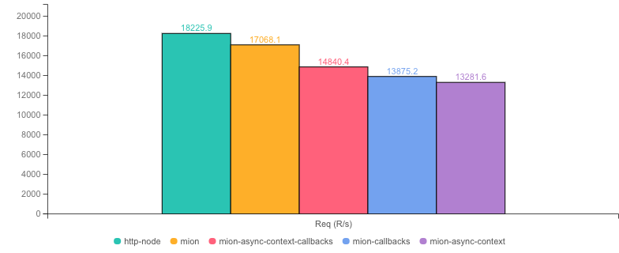
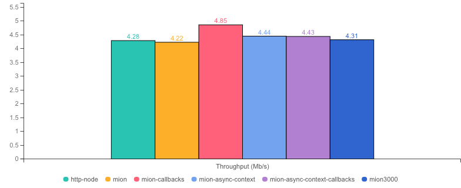
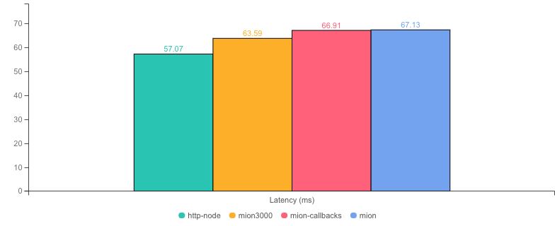
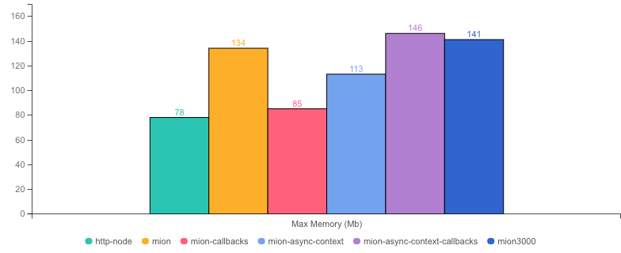
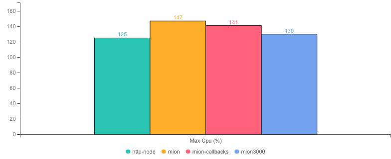
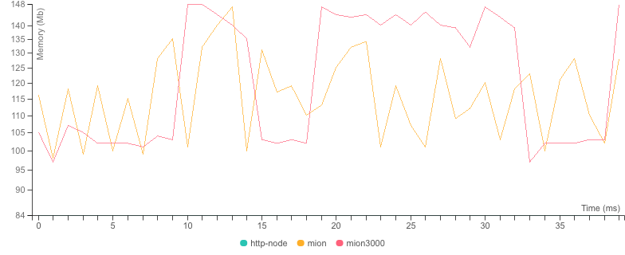

  <picture>
    <source media="(prefers-color-scheme: dark)" srcset="./assets/public/logo-dark.svg?raw=true">
    <source media="(prefers-color-scheme: light)" srcset="./assets/public/logo.svg?raw=true">
    
  </picture>

  <strong>Benchmarks for  @mionkit/http 🚀</strong> 

  
  

# mion benchmarks using different settings

There is no one size fits all when optimizing performance, so mion offers few settings to configure according to different app needs.

- `HttpOptions.useCallbacks` : using callbacks instead promises when routing a call. defaults to promises.

We show the benchmarks and let you take your own conclusions!!

## Benchmark Results

* __Machine:__ darwin x64 | 8 vCPUs | 16.0GB Mem
* __Node:__ `v16.18.0`
* __Run:__ Mon Jul 31 2023 02:13:23 GMT+0100 (Irish Standard Time)
* __Method:__ `autocannon -c 100 -d 40.04 -p 10 localhost:3000` (two rounds; one to warm-up, one to measure)

#### Req (R/s) 

#### Throughput (Mb/s) 

#### Latency (ms) 

#### Max Memory (Mb) 

#### Max Cpu (%) 

#### Memory Series (MB) 

|                | Version   | Router | Req (R/s)   | Latency (ms) | Output (Mb/s) | Max Memory (Mb) | Max Cpu (%) | Validation | Description                                                          |
| :--            | --:       | --:    | :-:         | --:          | --:           | --:             | --:         | :-:        | :--                                                                  |
| http-node      | 16.18.0   | ✗      | 20317.2     | 48.73        | 4.20          | 82              | 129         | ✗          | theoretical upper limit in performance.                              |
| **mion**       | **0.1.0** | **✓**  | **17263.2** | **57.42**    | **4.77**      | **101**         | **127**     | **✓**      | **using mion http with promises `HttpOptions.useCallbacks = false`** |
| mion-callbacks | 0.1.0     | ✓      | 11537.6     | 86.12        | 4.82          | 87              | 132         | ✓          | using mion http with callbacks `HttpOptions.useCallbacks = true`     |
| mion3000       | 0.1.0     | ✓      | 11247.6     | 88.34        | 4.70          | 98              | 125         | ✓          | mion with 3000 routes loaded (should have the most memory usage)     |
