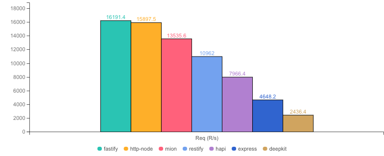
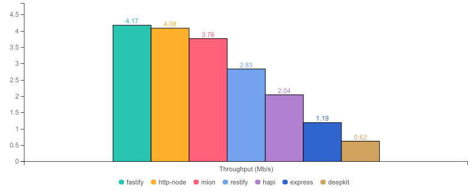
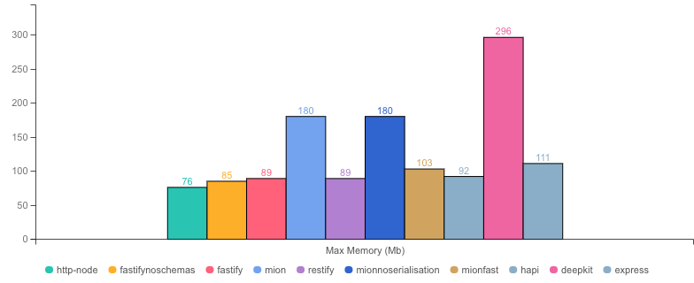
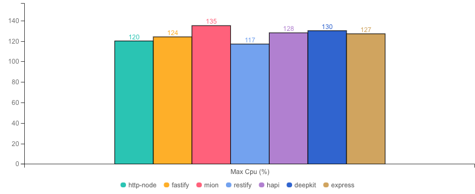

<p align="center">
  <picture>
    <source media="(prefers-color-scheme: dark)" srcset="./assets/public/logo-dark.svg?raw=true">
    <source media="(prefers-color-scheme: light)" srcset="./assets/public/logo.svg?raw=true">
    
  </picture>
</p>

<p align="center">
  <strong>Benchmarks for  @mionkit/http 🚀</strong><br/>
</p>

<p align=center>
  
  
</p>

# mion Http Benchmarks

- These benchmarks are based on the [fastify benchmarks](https://github.com/fastify/benchmarks) repo!
- `@MionKit/http` is part of the mion Framework. It uses and RPC style router!
- **This package shows how fast is mion comparatively to full featured frameworks like fastify and others.**
- You can find a full list of many other small and faster servers in the original fastify benchmarks repo.
- For metrics (cold-start) see [metrics.md](./METRICS.md)

📚 [Full mion framework documentation here!](https://github.com/MionKit/mion)

### Running & displaying the benchmarks

```sh
# start the tests
npm start

# display results in a table
npm run compare-t
```

### Cold start times

**For cold start times please check [METRICS.md](METRICS.md)**

Cold start times are also indicative of how the [serverless version](https://github.com/MionKit/mion/tree/master/packages/serverless) could perform in this regard, as both `@MionKit/http` an `@MionKit/serverless` are just a wrapper around `@MionKit/router` which contains all the logic.

## What's tested

The test consist of an `updateUser` request where the fields of the user must be validated, the `lastUpdate` field is a date that must be transformed into a JS Date (deserialized), and the same user must be returned back with an updated `lastUpdate` to the time of the request.

```ts
export interface User {
  id: number;
  name: string;
  surname: string;
  lastUpdate: Date;
}

// ### mion ###
// the received user by the route is already validated and deserialized
// user.lastUpdate is already a js date instead and string (result of JSON.parse)
export const routes: Routes = {
  updateUser: (context, user: User): User => {
    return {
      ...user,
      lastUpdate: new Date(),
    };
  },
};

// ### Express ###
// A plugin must be used to parse the json body
// validation must be done manually and user.lastUpdate must be deserialized manually into a date
// in this example the complexity would be in the isUser and deserializeUser functions (check src code fo that)
app.post("/updateUser", function (req, res) {
  const rawUser = req.body?.updateUser;
  if (!isUser(rawUser)) throw "app error, invalid parameter, not a user";
  const user = deserializeUser(rawUser);
  res.json({
    ...user,
    lastUpdate: new Date(),
  });
});
```

### Benchmarks

* __Machine:__ darwin x64 | 8 vCPUs | 16.0GB Mem
* __Node:__ `v16.18.0`
* __Run:__ Sat Jul 08 2023 20:44:57 GMT+0100 (Irish Standard Time)
* __Method:__ `autocannon -c 100 -d 40 -p 10 localhost:3000` (two rounds; one to warm-up, one to measure)

#### Req (R/s) 




#### Throughput (Mb/s) 




#### Latency (ms) 


#### Max Memory (Mb) 




#### Max Cpu (%) 




|           | Version        | Router | Req (R/s)   | Latency (ms) | Output (Mb/s) | Max Memory (Mb) | Max Cpu (%) | Validation | Description                                                                                                |
| :--       | --:            | --:    | :-:         | --:          | --:           | --:             | --:         | :-:        | :--                                                                                                        |
| fastify   | 4.19.2         | ✓      | 16191.4     | 61.24        | 4.17          | 90              | 68          | -          | Validation is done using schemas and ajv. Schemas must be generated manually or using third party tools.   |
| http-node | 16.18.0        | ✗      | 15897.5     | 62.41        | 4.08          | 80              | 69          | ✗          | Super basic and completely useless bare http server, should be the theoretical upper limit in performance. |
| **mion**  | **0.1.0**      | **✓**  | **13535.6** | **73.37**    | **3.76**      | **186**         | **75**      | **✓**      | **Automatic validation out of the box using @deepkit/types.**                                              |
| restify   | 8.6.1          | ✓      | 10962.0     | 90.99        | 2.83          | 106             | 53          | ✗          | Requires third party tools.                                                                                |
| hapi      | 20.3.0         | ✓      | 7966.4      | 124.90       | 2.04          | 101             | 72          | ✗          | Manual validation using joi, or third party tools.                                                         |
| express   | 4.18.2         | ✓      | 4648.2      | 214.14       | 1.19          | 111             | 65          | ✗          | needs third party tools, or third party tools                                                              |
| deepkit   | 1.0.1-alpha.75 | ✓      | 2436.4      | 410.82       | 0.62          | 284             | 64          | ✓          | Automatic validation out of the box (The ones that made @deepkit/types), Their rpc is way more performant. |
