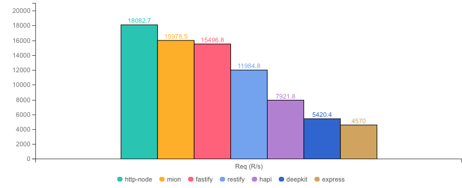
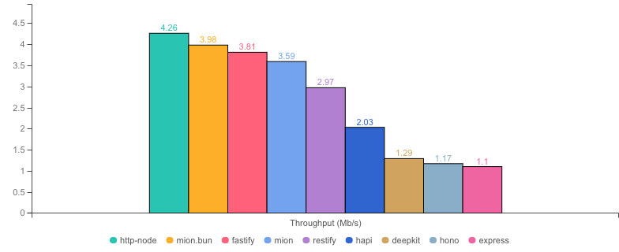
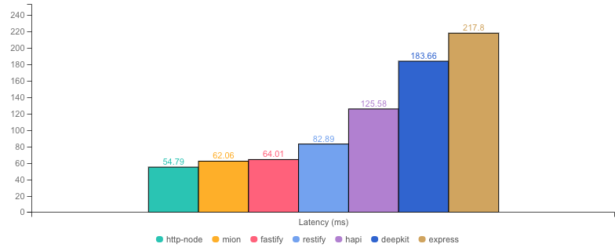
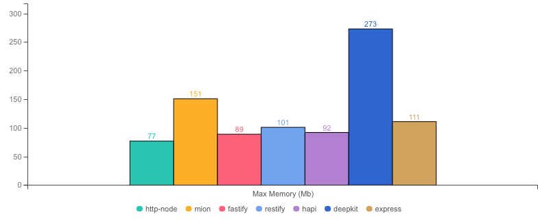
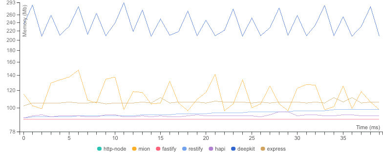

<p align="center">
  <picture>
    <source media="(prefers-color-scheme: dark)" srcset="./assets/public/logo-dark.svg?raw=true">
    <source media="(prefers-color-scheme: light)" srcset="./assets/public/logo.svg?raw=true">
    
  </picture>
</p>

<p align="center">
  <strong>Benchmarks for  @mionkit/http 🚀</strong><br/>
</p>

<p align=center>
  
  
</p>

# mion Http Benchmarks

- These benchmarks are based on the [fastify benchmarks](https://github.com/fastify/benchmarks) repo!
- `@MionKit/http` is part of the mion Framework. It uses and RPC style router!
- **This package shows how fast is mion comparatively to full featured frameworks like fastify and others.**
- You can find a full list of many other small and faster servers in the original fastify benchmarks repo.
- For cold-start metrics see [cold-starts.md](./COLD-STARTS.md)

📚 [Full mion framework documentation here!](https://github.com/MionKit/mion)

#### Running the benchmarks

install packages & link mion packages

```sh
npm i
npm link @mionkit/router @mionkit/core @mionkit/bun @mionkit/http
```

```sh
# running all benchmarks and update all readmes
npm run report
```

#### Cold Starts

- Cold start times: This is a metric we specially want to keep in check as fast cold start times are essential for serverless environments  
  [COLD-STARTS.md](COLD-STARTS.md)

## What's tested

The test consist of an `updateUser` request where the fields of the user must be validated, the `lastUpdate` field is a date that must be transformed into a JS Date (deserialized), then add one month and send back in the response.

> The benchmark involves both routing + validation of parameters!

```ts
export interface User {
  id: number;
  name: string;
  surname: string;
  lastUpdate: Date;
}

// ### mion ###
// the received user by the route is already validated and deserialized
// user.lastUpdate is already a js date instead and string (result of JSON.parse)
export const routes: Routes = {
  updateUser: (context, user: User): User => {
    user.lastUpdate.setMonth(user.lastUpdate.getMonth() + 1);
    return user;
  },
};

// ### Express ###
// A plugin must be used to parse the json body
// validation must be done manually and user.lastUpdate must be deserialized manually into a date
// in this case developer would have to manually write `isUser` and `deserializeUser` functions. (check src code fo those functions)
app.post("/updateUser", function (req, res) {
  const rawUser = req.body?.updateUser;
  if (!isUser(rawUser)) throw "app error, invalid parameter, not a user";
  const user = deserializeUser(rawUser);
  user.lastUpdate.setMonth(user.lastUpdate.getMonth() + 1);
  res.json(user);
});
```

#### Notes on current results:

mion is focused on being lightweight and fast so it can be run in serverless environments. We run the benchmarks before every PR gets merged to ensure there is no performance regression. There are [PRs](https://github.com/MionKit/mion/pull/48) that has been rejected because due to performance regression.

Our goal is to perform similar to fastify as it is the industry standard in terms of performance. Please always take benchmarks as general guidelines as you might obtain different results in your real world application. we just run the benchmarks to ensure there is no performance degradation when new features/fixes are added to mion.

## Benchmark Results

* __Machine:__ darwin x64 | 8 vCPUs | 16.0GB Mem
* __Node:__ `v20.11.0`
* __Run:__ Mon Jan 29 2024 01:48:11 GMT+0000 (Greenwich Mean Time)
* __Method:__ `autocannon -c 100 -d 40.01 -p 10 localhost:3000` (two rounds; one to warm-up, one to measure)

#### Req (R/s) 




#### Throughput (Mb/s) 




#### Latency (ms) 




#### Max Memory (Mb) 




#### Memory Series (MB) 




|           | Version   | Router | Req (R/s)   | Latency (ms) | Output (Mb/s) | Max Memory (Mb) | Max Cpu (%) | Validation | Description                                                                         |
| :--       | --:       | --:    | :-:         | --:          | --:           | --:             | --:         | :-:        | :--                                                                                 |
| http-node | 16.18.0   | ✗      | 18296.3     | 54.13        | 4.40          | 80              | 123         | ✗          | bare node http server, should be the theoretical upper limit in node.js performance |
| mion.bun  | 0.6.2     | ✓      | 17217.6     | 57.55        | 3.99          | 111             | 108         | ✓          | mion using bun, automatic validation and serialization                              |
| fastify   | 4.10.2    | ✓      | 16735.5     | 59.22        | 4.04          | 87              | 120         | -          | Validation using schemas and ajv. schemas are generated manually                    |
| **mion**  | **0.6.2** | **✓**  | **13797.0** | **71.92**    | **3.82**      | **142**         | **145**     | **✓**      | **Automatic validation and serialization out of the box**                           |
| restify   | 11.1.0    | ✓      | 12960.0     | 76.61        | 3.32          | 129             | 121         | ✗          | manual validation or third party tools                                              |
| hapi      | 21.3.2    | ✓      | 8815.5      | 112.79       | 2.12          | 96              | 131         | ✗          | validation using joi or third party tools                                           |
| hono      | 3.12.6    | ✓      | 5609.3      | 177.43       | 1.35          | 127             | 136         | ✗          | hono node server, manual validation or third party tools                            |
| express   | 4.18.2    | ✓      | 4563.9      | 214.79       | 1.10          | 127             | 126         | ✗          | manual validation or third party tools                                              |
