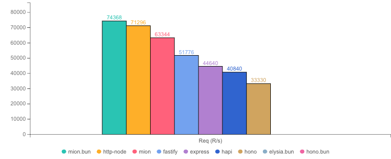
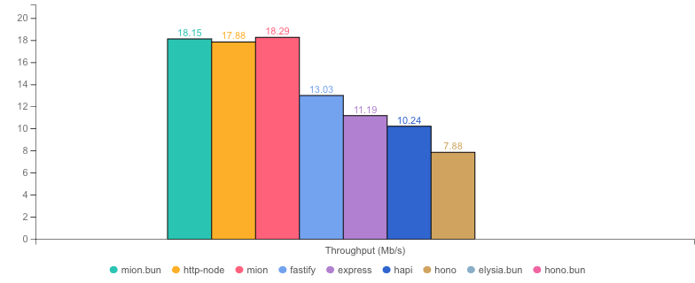
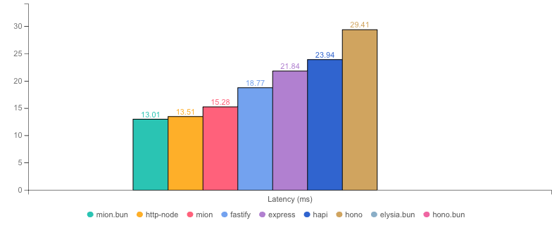
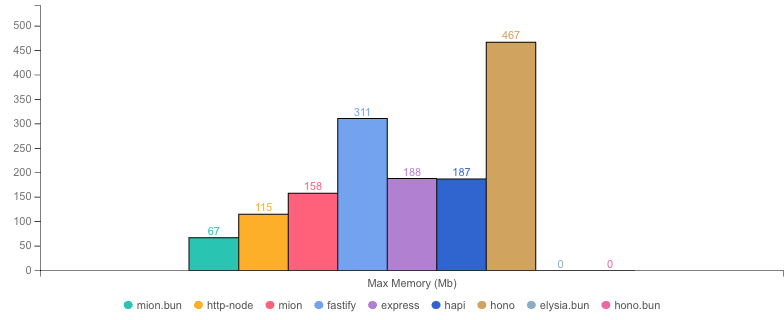
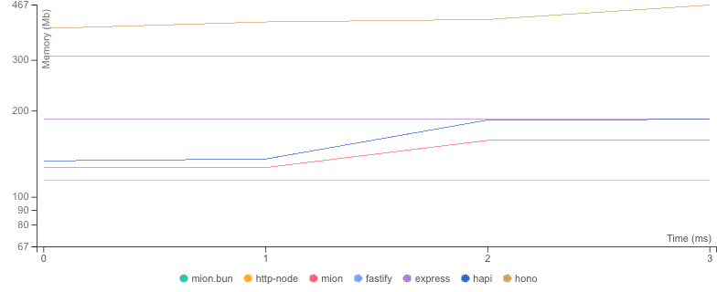

<p align="center">
  <picture>
    <source media="(prefers-color-scheme: dark)" srcset="./assets/images/logo-dark.svg?raw=true">
    <source media="(prefers-color-scheme: light)" srcset="./assets/images/logo.svg?raw=true">
    
  </picture>
</p>

<p align="center">
  <strong>Benchmarks for  @mionkit/node 🚀</strong><br/>
</p>

<p align=center>
  
  
</p>

# mion Http Benchmarks - Simple User

- These benchmarks are based on the [fastify benchmarks](https://github.com/fastify/benchmarks) repo!
- `@MionKit/http` is part of the mion Framework. It uses and RPC style router!
- **This benchmark tests a simple user model with minimal validation overhead.**

📚 [Full mion framework documentation here!](https://github.com/MionKit/mion)

#### Running the benchmarks

install packages & link mion packages

```sh
npm i
npm link @mionkit/router @mionkit/core @mionkit/bun @mionkit/node
```

```sh
# running simple-user benchmark
node reports.js simple-user

# running quick mode (4 seconds)
node reports.js simple-user --quick
```

## What's tested

The test consists of an `updateSimpleUser` request with a **simple User model (~100 bytes payload)** that includes:

- **Basic fields**: id (number), name (string), surname (string)
- **Single Date field**: lastUpdate (requires date coercion/serialization)

### SimpleUser Model

```typescript
interface SimpleUser {
  id: number;
  name: string;
  surname: string;
  lastUpdate: Date;
}
```

### Test Payload

```json
{
  "id": 12345678901234,
  "name": "John",
  "surname": "Doe",
  "lastUpdate": "2024-01-15T10:30:00.000Z"
}
```

This benchmark is designed to measure framework performance with minimal validation overhead, providing a baseline comparison against the more complex [Update User benchmark](./UPDATE-USER.md).

## Benchmark Results

* __Machine:__ darwin arm64 | 12 vCPUs | 16.0GB Mem
* __Node:__ `v24.13.0`
* __Run:__ Thu Feb 26 2026 23:55:16 GMT+0000 (Greenwich Mean Time)
* __Method:__ `autocannon -c 100 -d 4.04 -p 10 localhost:3000` (two rounds; one to warm-up, one to measure)

#### Req (R/s) 




#### Throughput (Mb/s) 




#### Latency (ms) 




#### Max Memory (Mb) 




#### Memory Series (MB) 




|              | Version   | Router | Req (R/s)   | Latency (ms) | Output (Mb/s) | Max Memory (Mb) | Max Cpu (%) | Validation | Description                                                |
| :--          | --:       | --:    | :-:         | --:          | --:           | --:             | --:         | :-:        | :--                                                        |
| **mion.bun** | **0.6.2** | **✓**  | **74368.0** | **13.01**    | **18.15**     | **67**          | **99**      | **✓**      | **mion using bun, automatic validation and serialization** |
| http-node    | 16.18.0   | ✗      | 71296.0     | 13.51        | 17.88         | 115             | 111         | ✓          | bare node http server with Zod validation                  |
| **mion**     | **0.6.2** | **✓**  | **63344.0** | **15.28**    | **18.29**     | **158**         | **110**     | **✓**      | **Automatic validation and serialization out of the box**  |
| fastify      | 5.7.4     | ✓      | 51776.0     | 18.77        | 13.03         | 311             | 133         | ✓          | Fastify with native JSON Schema validation                 |
| express      | 5.2.1     | ✓      | 44640.0     | 21.84        | 11.19         | 188             | 116         | ✓          | Express with Zod validation                                |
| hapi         | 21.4.4    | ✓      | 40840.0     | 23.94        | 10.24         | 187             | 113         | ✓          | Hapi with Zod validation                                   |
| hono         | 3.12.6    | ✓      | 33330.0     | 29.41        | 7.88          | 467             | 124         | ✓          | hono node server with Zod validation                       |
| elysia.bun   | 1.0.0     | ✓      | N/A         | N/A          | N/A           | 0               | 0           | ✓          | Elysia framework with TypeBox validation                   |
| hono.bun     | 3.12.6    | ✓      | N/A         | N/A          | N/A           | 0               | 0           | ✓          | hono bun server with Zod validation                        |
