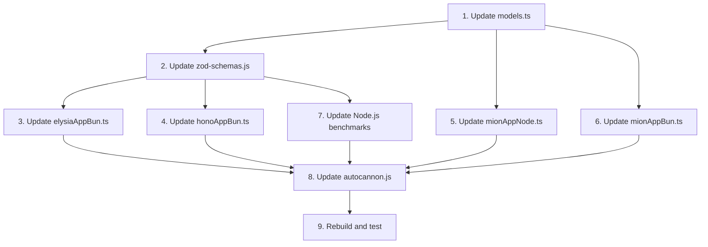

# Complex User Model for Benchmarks

## Problem Statement

Currently, mion is at a disadvantage in benchmarks because:

1. mion sends data wrapped in an array for RPC-style API calls
2. The current User model is very simple (4 fields)
3. When payload is small, the array wrapper overhead is proportionally significant

**Current User Model:**

```typescript
interface User {
  id: number;
  name: string;
  surname: string;
  lastUpdate: Date;
}
```

**Current payload sizes:**

- Other frameworks: ~80 bytes
- mion: ~82 bytes (array wrapper adds `[]`)

## Solution

Create a more complex User model that:

1. Has nested objects (address, preferences)
2. Uses discriminated unions (payment methods)
3. Includes arrays of complex types
4. Has optional fields with defaults
5. Uses Date types that require serialization/deserialization

This will:

- Make the payload larger, reducing the relative impact of the array wrapper
- Showcase mion's strength in automatic validation and serialization
- Create a more realistic real-world scenario

## Proposed User Model

```typescript
// ============ Union Types (instead of enums) ============
export type UserRole = "admin" | "user" | "guest" | "moderator";

export type AccountStatus =
  | "active"
  | "suspended"
  | "pending_verification"
  | "deactivated";

// ============ Nested Objects ============
export interface Address {
  street: string;
  city: string;
  state: string;
  zipCode: string;
  country: string;
}

export interface UserPreferences {
  theme: "light" | "dark" | "system";
  language: string;
  timezone: string;
  notifications: NotificationSettings;
}

export interface NotificationSettings {
  email: boolean;
  sms: boolean;
  push: boolean;
  frequency: "immediate" | "daily" | "weekly";
}

// ============ Discriminated Union ============
export type PaymentMethod =
  | {
      type: "credit_card";
      lastFourDigits: string;
      expiryMonth: number;
      expiryYear: number;
      brand: string;
    }
  | {
      type: "bank_account";
      bankName: string;
      accountLastFour: string;
      routingNumber: string;
    }
  | { type: "paypal"; email: string };

// ============ User Model ============
export interface User {
  // Basic info
  id: number;
  username: string;
  email: string;

  // Profile
  profile: {
    firstName: string;
    lastName: string;
    displayName: string;
    bio?: string;
    avatarUrl?: string;
    dateOfBirth: Date;
  };

  // Account metadata
  role: UserRole;
  status: AccountStatus;

  // Single address
  address: Address;

  // Array of discriminated union
  paymentMethods: PaymentMethod[];

  // Preferences
  preferences: UserPreferences;

  // Timestamps
  createdAt: Date;
  updatedAt: Date;
  lastLoginAt?: Date;

  // Tags
  tags: string[];
}
```

## Files to Update

### 1. TypeScript Models - [`apps/src/models.ts`](apps/src/models.ts)

- Replace existing User interface with new complex model
- Add all supporting interfaces and types

### 2. Zod Schemas - [`lib/zod-schemas.js`](lib/zod-schemas.js)

- Create corresponding Zod schemas for all types
- Use discriminated unions with `z.discriminatedUnion()`
- Use `z.coerce.date()` for Date fields

### 3. Elysia TypeBox Schemas - [`apps/src/elysiaAppBun.ts`](apps/src/elysiaAppBun.ts)

- Create TypeBox schemas with Transform for dates
- Use `t.Union()` with discriminator for unions

### 4. Hono Bun Schemas - [`apps/src/honoAppBun.ts`](apps/src/honoAppBun.ts)

- Update Zod schemas inline

### 5. Autocannon Test Data - [`lib/autocannon.js`](lib/autocannon.js:50-68)

- Update the test payload to use new User model
- Generate realistic test data

### 6. Benchmark Servers

All servers need to update their `/updateUser` endpoint:

- [`benchmarks/fastify.js`](benchmarks/fastify.js)
- [`benchmarks/express.js`](benchmarks/express.js)
- [`benchmarks/hono.js`](benchmarks/hono.js)
- [`benchmarks/hapi.js`](benchmarks/hapi.js)
- [`apps/src/mionAppNode.ts`](apps/src/mionAppNode.ts)
- [`apps/src/mionAppBun.ts`](apps/src/mionAppBun.ts)

## Sample Test Payload Generator

**IMPORTANT:** The payload must have a **dynamic `id`** field to prevent frameworks from caching responses. Create a `generateSampleUser()` function in [`lib/autocannon.js`](lib/autocannon.js) that generates a new random ID for each request.

```javascript
// lib/autocannon.js - Sample payload generator function using template literals
// This avoids JSON.stringify overhead on each request - only the dynamic id is interpolated
function generateSampleUser(isMion = false) {
  const id = Math.floor(Math.random() * Number.MAX_SAFE_INTEGER);

  // Use template literal to avoid JSON.stringify overhead
  // Only the id is dynamic, rest is static string
  const userJson = `{"id":${id},"username":"john_smith","email":"john.smith@example.com","profile":{"firstName":"John","lastName":"Smith","displayName":"John S.","bio":"Software developer and tech enthusiast","avatarUrl":"https://example.com/avatars/john.jpg","dateOfBirth":"1990-05-15T00:00:00.000Z"},"role":"user","status":"active","address":{"street":"123 Main Street","city":"San Francisco","state":"CA","zipCode":"94102","country":"USA"},"paymentMethods":[{"type":"credit_card","lastFourDigits":"4242","expiryMonth":12,"expiryYear":2025,"brand":"visa"},{"type":"paypal","email":"john.paypal@example.com"}],"preferences":{"theme":"dark","language":"en-US","timezone":"America/Los_Angeles","notifications":{"email":true,"sms":false,"push":true,"frequency":"daily"}},"createdAt":"2020-01-15T10:30:00.000Z","updatedAt":"2024-12-17T02:24:00.000Z","lastLoginAt":"2024-12-16T18:45:00.000Z","tags":["premium","early-adopter","verified"]}`;

  // mion wraps request body in array for RPC-style API
  return isMion ? `[${userJson}]` : userJson;
}
```

**Usage in autocannon setupRequest:**

```javascript
setupRequest: (req, context) => {
  const body = generateSampleUser(handler.includes("mion"));
  req.body = body;
  req.headers = {
    accept: "*/*",
    "Content-Type": "application/json",
    "Content-Length": body.length,
  };
  return req;
};
```

**Estimated payload size:** ~1KB (vs current ~80 bytes)

## Business Logic Update

The `updateUser` endpoint should perform meaningful operations:

```typescript
function updateUser(user: User): User {
  // Update timestamp
  user.updatedAt = new Date();

  // Simulate some business logic
  user.lastLoginAt = new Date();

  // Update profile modification
  user.profile.displayName = `${user.profile.firstName} ${user.profile.lastName.charAt(0)}.`;

  return user;
}
```

## Implementation Order



## Validation Complexity

This model tests:

- **Nested object validation** - profile, preferences, address, notifications
- **Array validation** - paymentMethods[], tags[]
- **Discriminated union validation** - paymentMethods
- **Union type validation** - role, status
- **Date serialization/deserialization** - 4 Date fields (dateOfBirth, createdAt, updatedAt, lastLoginAt)
- **Optional field handling** - bio, avatarUrl, lastLoginAt
- **Literal type validation** - theme, frequency

This complexity is where mion's automatic type-based validation shines compared to manual schema definitions.

## Expected Outcome

With a larger, more complex payload:

1. The array wrapper overhead becomes negligible (~0.15% vs ~2.5%)
2. Validation/serialization time becomes the dominant factor
3. mion's automatic type inference should perform competitively or better
4. Results will be more representative of real-world API scenarios
