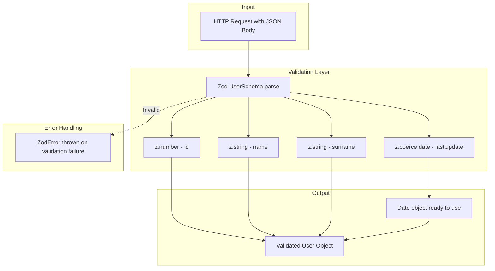

# Zod Validation Integration Specification

## Overview

This specification outlines the plan to integrate Zod validation and serialization across all non-mion benchmark servers. This change ensures a fair comparison between mion (which provides automatic validation/serialization) and other frameworks (which will now use Zod for the same functionality).

## Current State Analysis

### Mion Approach

Mion provides **automatic validation and serialization** out of the box using TypeScript types:

```typescript
// apps/src/mionAppNode.ts
export const routes = {
  updateUser: route((ctx, user: User): User => {
    user.lastUpdate.setMonth(user.lastUpdate.getMonth() + 1);
    return user;
  }),
} satisfies Routes;
```

The `User` type is automatically validated and the `lastUpdate` field is automatically deserialized from ISO string to `Date` object.

### Current Non-Mion Approach

All other frameworks use **manual validation** with custom helper functions:

```javascript
// Manual validation pattern used across all benchmarks
const hasUnknownKeys = (knownKeys, input) => {
  if (typeof input !== "object") return true;
  const unknownKeys = Object.keys(input);
  return unknownKeys.some((ukn) => !knownKeys.includes(ukn));
};

const isUser = (input) => {
  if (typeof input !== "object") return false;
  if (hasUnknownKeys(["id", "name", "surname", "lastUpdate"], input))
    return false;
  return (
    typeof input?.id === "number" &&
    typeof input?.name === "string" &&
    typeof input?.surname === "string" &&
    typeof input?.lastUpdate === "string"
  );
};

const deserializeUser = (jsonParseResult) => {
  if (typeof jsonParseResult?.lastUpdate === "string")
    return {
      ...jsonParseResult,
      lastUpdate: new Date(jsonParseResult.lastUpdate),
    };
  return jsonParseResult;
};
```

### Exceptions

- **Fastify** (`benchmarks/fastify.js`): Uses JSON Schema with Ajv for validation (no manual `isUser`), but still needs manual date deserialization
- **Elysia** (`apps-bun/src/elysia.bun.ts`): Uses TypeBox for validation, but still needs manual `deserializeUser` for date conversion - **needs update**

---

## Files to Modify

### Node.js Benchmarks (`./benchmarks/`)

| File                                                | Current Validation                           | Change Required                               |
| --------------------------------------------------- | -------------------------------------------- | --------------------------------------------- |
| [`express.js`](benchmarks/express.js)               | Manual `isUser` + `deserializeUser`          | Replace with Zod                              |
| [`fastify.js`](benchmarks/fastify.js)               | JSON Schema (Ajv) + manual `deserializeUser` | Replace with Zod                              |
| [`fastify-manual.js`](benchmarks/fastify-manual.js) | Manual `isUser` + `deserializeUser`          | Replace with Zod                              |
| [`hapi.js`](benchmarks/hapi.js)                     | Manual `isUser` + `deserializeUser`          | Replace with Zod                              |
| [`hono.js`](benchmarks/hono.js)                     | Manual `isUser` + `deserializeUser`          | Replace with Zod                              |
| [`http-node.js`](benchmarks/http-node.js)           | Manual `isUser` + `deserializeUser`          | Replace with Zod                              |
| [`deepkit.js`](benchmarks/deepkit.js)               | Deepkit native validation                    | Keep as-is (uses native validation like mion) |
| [`mion.js`](benchmarks/mion.js)                     | Mion native validation                       | Keep as-is                                    |
| [`mion.bun.js`](benchmarks/mion.bun.js)             | Mion native validation                       | Keep as-is                                    |
| [`mion3000.js`](benchmarks/mion3000.js)             | Mion native validation                       | Keep as-is                                    |
| [`trpc-router.js`](benchmarks/trpc-router.js)       | Commented out                                | Skip (not active)                             |

### Bun Apps (`./apps-bun/src/`)

| File                                          | Current Validation                  | Change Required                                                          |
| --------------------------------------------- | ----------------------------------- | ------------------------------------------------------------------------ |
| [`hono.bun.ts`](apps-bun/src/hono.bun.ts)     | Manual `isUser` + `deserializeUser` | Replace with Zod                                                         |
| [`elysia.bun.ts`](apps-bun/src/elysia.bun.ts) | TypeBox + manual `deserializeUser`  | Update TypeBox schema to use `t.Transform()` for automatic date coercion |

---

## Zod Schema Definition

### Shared Schema Module

Create a shared Zod schema module that can be used across all benchmarks:

```javascript
// lib/zod-schemas.js (for Node.js CommonJS)
"use strict";

const { z } = require("zod");

// User schema with automatic date coercion
const UserSchema = z
  .object({
    id: z.number(),
    name: z.string(),
    surname: z.string(),
    lastUpdate: z.coerce.date(), // Automatically converts ISO string to Date
  })
  .strict(); // Rejects unknown keys (matches current behavior)

// Hello response schema
const HelloSchema = z.object({
  hello: z.string(),
});

module.exports = {
  UserSchema,
  HelloSchema,
};
```

```typescript
// lib/zod-schemas.ts (for Bun TypeScript)
import { z } from "zod";

// User schema with automatic date coercion
export const UserSchema = z
  .object({
    id: z.number(),
    name: z.string(),
    surname: z.string(),
    lastUpdate: z.coerce.date(), // Automatically converts ISO string to Date
  })
  .strict(); // Rejects unknown keys

export type User = z.infer<typeof UserSchema>;

// Hello response schema
export const HelloSchema = z.object({
  hello: z.string(),
});

export type HelloResponse = z.infer<typeof HelloSchema>;
```

### Key Zod Features Used

1. **`z.coerce.date()`**: Automatically converts ISO 8601 strings to `Date` objects (replaces manual `deserializeUser`)
2. **`.strict()`**: Rejects objects with unknown keys (matches current `hasUnknownKeys` behavior)
3. **`.parse()`**: Validates and transforms input, throws `ZodError` on failure

---

## Implementation Details

### Pattern for Each Framework

#### Express.js

```javascript
// benchmarks/express.js
"use strict";

const express = require("express");
const { UserSchema } = require("../lib/zod-schemas");

const app = express();
app.use(express.json());
app.use((err, req, res, next) => {
  if (err.name === "ZodError") {
    res.status(400).json({ error: "Validation failed", details: err.errors });
  } else if (err.message?.includes("app error")) {
    res.status(400).json({ error: err.message });
  } else {
    res.status(500).send("Something broke!");
  }
});

app.disable("etag");
app.disable("x-powered-by");

app.get("/hello", function (req, res) {
  res.json({ hello: "world" });
});

app.post("/updateUser", function (req, res) {
  const user = UserSchema.parse(req.body); // Validates + deserializes date
  user.lastUpdate.setMonth(user.lastUpdate.getMonth() + 1);
  res.json(user);
});

app.listen(3000);
```

#### Fastify.js

```javascript
// benchmarks/fastify.js
"use strict";

const { UserSchema } = require("../lib/zod-schemas");

const fastify = require("fastify")();

fastify.get("/hello", function (req, reply) {
  reply.send({ hello: "world" });
});

fastify.post("/updateUser", async function (req, reply) {
  const user = UserSchema.parse(req.body); // Validates + deserializes date
  user.lastUpdate.setMonth(user.lastUpdate.getMonth() + 1);
  reply.send(user);
});

fastify.listen({ port: 3000, host: "localhost" });
```

#### Hono.js (Node)

```javascript
// benchmarks/hono.js
const { serve } = require("@hono/node-server");
const { Hono } = require("hono");
const { UserSchema } = require("../lib/zod-schemas");

const app = new Hono();

app.get("/hello", (c) => {
  return c.json({ hello: "world" });
});

app.post("/updateUser", async (c) => {
  const rawUser = await c.req.json();
  const user = UserSchema.parse(rawUser); // Validates + deserializes date
  user.lastUpdate.setMonth(user.lastUpdate.getMonth() + 1);
  return c.json(user);
});

serve({ fetch: app.fetch, port: 3000 });
```

#### Hono.bun.ts (Bun)

```typescript
// apps-bun/src/hono.bun.ts
import { Hono } from "hono";
import { UserSchema } from "../../lib/zod-schemas";

const app = new Hono();

app.get("/hello", async (c) => {
  return c.json({ hello: "world" });
});

app.post("/updateUser", async (c) => {
  const rawUser = await c.req.json();
  const user = UserSchema.parse(rawUser); // Validates + deserializes date
  user.lastUpdate.setMonth(user.lastUpdate.getMonth() + 1);
  return c.json(user);
});

export default app;
```

#### Elysia.bun.ts (TypeBox with Transform)

Elysia uses TypeBox natively. We'll use `t.Transform()` to automatically coerce the date string to a `Date` object:

```typescript
// apps-bun/src/elysia.bun.ts
import { Elysia, t } from "elysia";
import { cors } from "@elysiajs/cors";

export interface User {
  id: number;
  name: string;
  surname: string;
  lastUpdate: Date;
}

// TypeBox schema with Transform for automatic date coercion
const DateString = t
  .Transform(t.String({ format: "date-time" }))
  .Decode((value) => new Date(value)) // string -> Date on input
  .Encode((value) => value.toISOString()); // Date -> string on output

const UserSchema = t.Object({
  id: t.Number(),
  name: t.String(),
  surname: t.String(),
  lastUpdate: DateString,
});

const app = new Elysia()
  .use(cors())
  .get("/hello", async () => ({ hello: "world" }))
  .post(
    "/updateUser",
    async ({ body }) => {
      // body.lastUpdate is already a Date object thanks to Transform
      body.lastUpdate.setMonth(body.lastUpdate.getMonth() + 1);
      return body;
    },
    {
      body: UserSchema,
    },
  )
  .listen(3000);

console.log(
  `🦊 Elysia is running at ${app.server?.hostname}:${app.server?.port}`,
);
```

#### Hapi.js

```javascript
// benchmarks/hapi.js
"use strict";

require("make-promises-safe");
const Hapi = require("@hapi/hapi");
const { UserSchema } = require("../lib/zod-schemas");

async function start() {
  const server = Hapi.server({ port: 3000, debug: false });

  server.route({
    method: "GET",
    path: "/hello",
    config: {
      cache: false,
      response: { ranges: false },
      state: { parse: false },
    },
    handler: function (request, h) {
      return { hello: "world" };
    },
  });

  server.route({
    method: "POST",
    path: "/updateUser",
    config: {
      cache: false,
      response: { ranges: false },
      state: { parse: false },
    },
    handler: function (request, h) {
      const user = UserSchema.parse(request.payload); // Validates + deserializes date
      user.lastUpdate.setMonth(user.lastUpdate.getMonth() + 1);
      return user;
    },
  });

  await server.start();
}

start();
```

#### http-node.js (Bare Node)

```javascript
// benchmarks/http-node.js
"use strict";

const { UserSchema } = require("../lib/zod-schemas");

const reply = (httpResponse, json, statusCode) => {
  httpResponse.statusCode = statusCode;
  httpResponse.setHeader("content-length", json.length);
  httpResponse.write(json);
  httpResponse.end();
};

const server = require("http").createServer(function (req, res) {
  res.setHeader("content-type", "application/json; charset=utf-8");

  const data = [];
  req.on("data", function (chunk) {
    data.push(chunk);
  });

  req.on("end", function () {
    const rawBody = Buffer.concat(data).toString();
    if (req.url === "/hello") {
      res.end(JSON.stringify({ hello: "world" }));
    } else if (req.url === "/updateUser") {
      try {
        const body = JSON.parse(rawBody);
        const user = UserSchema.parse(body); // Validates + deserializes date
        user.lastUpdate.setMonth(user.lastUpdate.getMonth() + 1);
        const resBody = JSON.stringify(user);
        reply(res, resBody, 200);
      } catch (err) {
        const errorBody = JSON.stringify({
          error:
            err.name === "ZodError" ? "Validation failed" : "Invalid input",
        });
        reply(res, errorBody, 400);
      }
    } else {
      const errorBody = JSON.stringify({ error: "route not found" });
      reply(res, errorBody, 404);
    }
  });
});

server.listen(3000);
```

---

## Package.json Updates

### Root package.json

Add Zod as a dependency:

```json
{
  "dependencies": {
    "zod": "^3.23.8"
  }
}
```

### apps-bun/package.json

Add Zod as a dependency:

```json
{
  "dependencies": {
    "zod": "^3.23.8"
  }
}
```

---

## lib/packages.js Updates

Update the validation status for frameworks now using Zod:

```javascript
const packages = {
  "http-node": {
    hasRouter: false,
    version: "16.18.0",
    validation: "✓", // Changed from "✗"
    description: "bare node http server with Zod validation",
  },
  hono: {
    hasRouter: true,
    package: "hono",
    validation: "✓", // Changed from "✗"
    version: "3.12.6",
    description: "hono node server with Zod validation",
  },
  "hono.bun": {
    hasRouter: true,
    package: "hono",
    validation: "✓", // Changed from "✗"
    version: "3.12.6",
    description: "hono bun server with Zod validation",
    isBun: true,
    srcDir: "apps-bun/src",
  },
  fastify: {
    hasRouter: true,
    package: "fastify",
    validation: "✓", // Changed from "-"
    description: "Fastify with Zod validation",
  },
  hapi: {
    hasRouter: true,
    package: "@hapi/hapi",
    validation: "✓", // Changed from "✗"
    description: "Hapi with Zod validation",
  },
  express: {
    hasRouter: true,
    validation: "✓", // Changed from "✗"
    description: "Express with Zod validation",
  },
};
```

---

## Architecture Diagram



---

## Validation Comparison

| Feature               | Manual Validation | Zod Validation                | Mion      |
| --------------------- | ----------------- | ----------------------------- | --------- |
| Type checking         | ✓                 | ✓                             | ✓         |
| Unknown key rejection | ✓                 | ✓ (`.strict()`)               | ✓         |
| Date deserialization  | Manual            | Automatic (`z.coerce.date()`) | Automatic |
| Error messages        | Basic             | Detailed                      | Detailed  |
| Type inference        | ✗                 | ✓ (`z.infer`)                 | ✓         |
| Schema reusability    | ✗                 | ✓                             | ✓         |

---

## Implementation Checklist

### Phase 1: Setup

- [ ] Add Zod dependency to root `package.json`
- [ ] Add Zod dependency to `apps-bun/package.json`
- [ ] Create `lib/zod-schemas.js` (CommonJS for Node.js benchmarks)
- [ ] Create `lib/zod-schemas.ts` (TypeScript for Bun apps)

### Phase 2: Node.js Benchmarks

- [ ] Update `benchmarks/express.js`
- [ ] Update `benchmarks/fastify.js`
- [ ] Update `benchmarks/fastify-manual.js`
- [ ] Update `benchmarks/hapi.js`
- [ ] Update `benchmarks/hono.js`
- [ ] Update `benchmarks/http-node.js`

### Phase 3: Bun Apps

- [ ] Update `apps-bun/src/hono.bun.ts`
- [ ] Update `apps-bun/src/elysia.bun.ts` (TypeBox Transform for date coercion)

### Phase 4: Documentation

- [ ] Update `lib/packages.js` validation status
- [ ] Update `README.md` to reflect Zod usage
- [ ] Update `AGENTS.md` if needed

### Phase 5: Testing

- [ ] Run `npm run quick-servers` to verify all benchmarks work
- [ ] Run `npm run servers-hello` to verify hello endpoint
- [ ] Verify error handling for invalid input

---

## Notes

1. **Elysia uses TypeBox with Transform**: Elysia has built-in TypeBox validation. We'll use `t.Transform()` to add automatic date coercion, keeping the native TypeBox approach while ensuring proper deserialization.

2. **Deepkit stays with native validation**: Deepkit, like mion, has automatic validation based on TypeScript types. It should remain as-is for fair comparison.

3. **Performance consideration**: Zod adds some overhead compared to manual validation, but this is the point - we want to compare frameworks with proper validation libraries, not hand-rolled minimal validation.

4. **Error handling**: Each framework should handle `ZodError` appropriately and return a 400 status code with error details.

5. **Date serialization on response**: Zod handles input validation/deserialization. For output, `JSON.stringify()` will automatically convert `Date` objects to ISO strings, which matches the current behavior.
